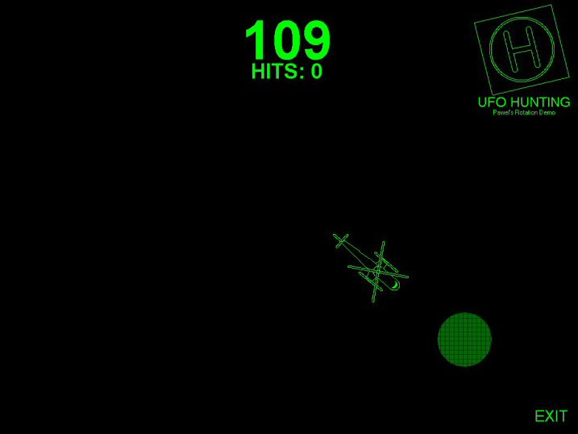



## Pure VB Rotation Demo \(UFO Hunting Game\)

### Description

My UFO Hunting game shows that you can create rotations with just VB, and using pretty simple code. In the game, the helicopter follows your cursor, always pointing in its direction, and using the searchlight, you try to spot the "UFO" (the black circle moving around on the screen), and click it to get points, all in 120 seconds. Just for fun, I included some cheats. To have a two-bladed helicopter, type "double" and to have slow spinning rotors, type "slow." Enjoy, and please vote!
 
### More Info
 
Please know that this is full-screen and is supposed to be viewed at a 1024 by 768 resolution. If your monitor is smaller than that, the exit button might be cut off. If it is, just quit out using Ctrl+Alt+Delete.

             |
---                |---
**Submitted On**   |2004-01-02 16:39:00
**By**             |[Pawel M\.](https://github.com/Planet-Source-Code/PSCIndex/blob/master/ByAuthor/pawel-m.md)
**Level**          |Intermediate
**User Rating**    |4.7 (14 globes from 3 users)
**Compatibility**  |VB 6\.0
**Category**       |[Games](https://github.com/Planet-Source-Code/PSCIndex/blob/master/ByCategory/games__1-38.md)
**World**          |[Visual Basic](https://github.com/Planet-Source-Code/PSCIndex/blob/master/ByWorld/visual-basic.md)
**Archive File**   |[Pure\_VB\_Ro168974122004\.zip](https://github.com/Planet-Source-Code/pawel-m-pure-vb-rotation-demo-ufo-hunting-game__1-50748/archive/master.zip)

